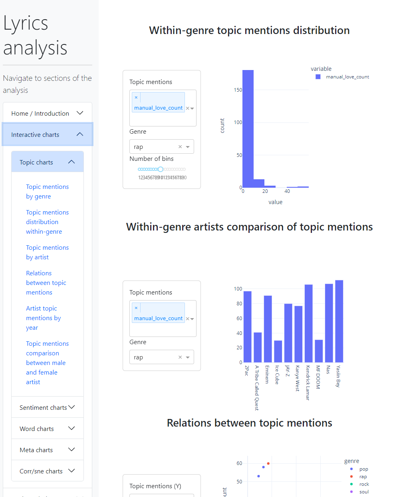

# Lyrics Analysis
Analyzing relationships between the content and characteristics of selected artists lyrics from selected genres. Mostly explaratory, but some modelling work was also done, particularly in terms of genre / artist classification and stats regression.

### Usage
#### Local
```
python -m pip install -r requirements.txt
cd src
python app.py
```
#### Deploy:
[Lyrics Analysis](https://lyrics-analysis.onrender.com/)



### Main parts of the project include:
* analysis of lyrics from genres: pop, rap, rock and soul, exploring inter- and intra- genre relationships between topical mentions, word usage and additional song and artist metadata
* analysis of lyrics from rap between decades spanning from 1980s to 2020s
* aforementioned ML tasks

### Work done / data wrangling:
* gathering of lyrics from genius.com, combining, organizing
* cleaning up any inconsistencies in formatting, removing unnecessary punctuation, non-lyrics meta parts and the general universalization of the corpus with **pandas**
* developing metrics of measurement from the lyrics, including topical mention counts, finding popular words and n-grams frequencies, emotion and sentiment classification on pre-trained models, part of speech tagging and others with **pandas**, **spacy**, **NLTK**, **huggingface**
* developing interactive **plotly** and **dash** charts
* a static, manual exploration and attempt at explanation of revealed relations
* classification and regression ML modeling with **scikit-learn**

### Supplementary repo:
Most of this work can be seen in another of my repositories [data_projects](https://github.com/Kakackle/data_projects), particularly in the lyrics_analysis folder, which contains **jupyter notebooks** with the aforementioned work

### Inspired by:
https://www.johnwmillr.com/trucks-and-beer/, using the supplied genius.com API wrapper to download the lyrics and song metadata
